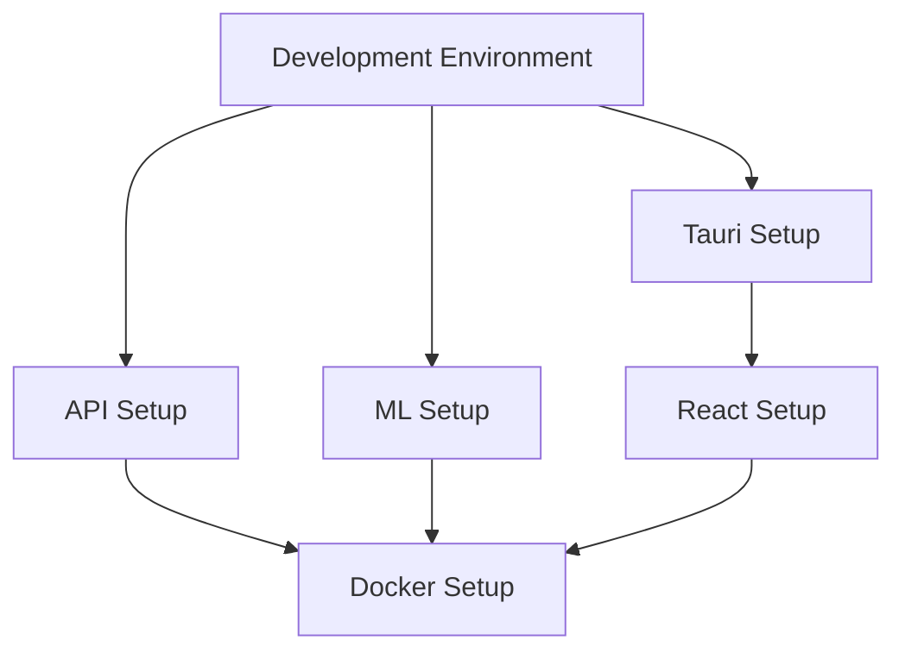

# 🛠️ Setup Guides - Helen System

Guías completas de configuración para todos los componentes del sistema Helen.

## 📚 Índice de Guías

### 1️⃣ [Development Environment Setup](./DEVELOPMENT_ENVIRONMENT.md)
**Comienza aquí** - Configuración inicial del entorno de desarrollo.

**Incluye:**
- ✅ Instalación de Node.js, Python y Rust
- ✅ Configuración de Git
- ✅ Dependencias del sistema
- ✅ Verificación de instalación
- ✅ Troubleshooting común

**Tiempo estimado**: 30-45 minutos

---

### 2️⃣ [Tauri Setup](./TAURI_SETUP.md)
Configuración del frontend con Tauri (React + Rust).

**Incluye:**
- Instalación de dependencias de Tauri
- Configuración de tauri.conf.json
- Personalización de iconos
- Integración con API backend
- Configuración de seguridad
- Build para diferentes plataformas

**Tiempo estimado**: 20-30 minutos

**Pre-requisitos**: Development Environment Setup ✅

---

### 3️⃣ [React Setup](./REACT_SETUP.md)
Configuración de React y componentes del frontend.

**Incluye:**
- Configuración de Vite
- Setup de Tailwind CSS
- Integración con MediaPipe
- Servicios de API
- Estructura de componentes
- Testing con Vitest

**Tiempo estimado**: 30-40 minutos

**Pre-requisitos**: Tauri Setup ✅

---

### 4️⃣ [API Setup](./API_SETUP.md)
Configuración del backend API con FastAPI.

**Incluye:**
- Instalación de FastAPI y dependencias
- Configuración de variables de entorno
- Integración con modelo ML
- Sistema de logging
- Tests unitarios
- Despliegue en producción

**Tiempo estimado**: 25-35 minutos

**Pre-requisitos**: Development Environment Setup ✅

---

### 5️⃣ [ML Setup](./ML_SETUP.md)
Configuración del servicio de Machine Learning.

**Incluye:**
- Instalación de PyTorch
- Preparación de datasets
- Arquitectura del modelo
- Script de entrenamiento
- Monitoreo con TensorBoard
- Evaluación de modelos

**Tiempo estimado**: 45-60 minutos

**Pre-requisitos**: Development Environment Setup ✅

---

### 6️⃣ [Docker Setup](./DOCKER_SETUP.md)
Configuración de Docker y containerización.

**Incluye:**
- Instalación de Docker
- Creación de Dockerfiles
- Docker Compose
- Configuración de seguridad
- Monitoreo de contenedores
- Deploy en producción

**Tiempo estimado**: 30-40 minutos

**Pre-requisitos**: Todos los setups anteriores ✅

---

## 🎯 Guía de Inicio Rápido

### Para Desarrolladores Frontend

```bash
# 1. Setup básico
Ver: DEVELOPMENT_ENVIRONMENT.md

# 2. Configurar Tauri
Ver: TAURI_SETUP.md

# 3. Configurar React
Ver: REACT_SETUP.md

# 4. Iniciar desarrollo
cd frontend
npm run tauri dev
```

### Para Desarrolladores Backend

```bash
# 1. Setup básico
Ver: DEVELOPMENT_ENVIRONMENT.md

# 2. Configurar API
Ver: API_SETUP.md

# 3. Iniciar API
cd backend/api
source venv/bin/activate
python api_service.py
```

### Para Científicos de Datos / ML Engineers

```bash
# 1. Setup básico
Ver: DEVELOPMENT_ENVIRONMENT.md

# 2. Configurar ML Service
Ver: ML_SETUP.md

# 3. Entrenar modelo
cd backend/ml-service
source venv/bin/activate
python train_solid.py
```

### Para DevOps / Deploy

```bash
# 1. Todos los setups anteriores

# 2. Configurar Docker
Ver: DOCKER_SETUP.md

# 3. Deploy con Docker Compose
docker compose up -d
```

---

## 🔄 Orden Recomendado de Setup



### Orden Completo:

1. **DEVELOPMENT_ENVIRONMENT.md** (OBLIGATORIO - primero)
2. Después, según tu rol:
   - Frontend: **TAURI_SETUP.md** → **REACT_SETUP.md**
   - Backend: **API_SETUP.md**
   - ML: **ML_SETUP.md**
3. **DOCKER_SETUP.md** (último - para deploy)

---

## ⏱️ Tiempo Total Estimado

- **Setup Mínimo** (desarrollo local): ~1.5-2 horas
- **Setup Completo** (con Docker): ~3-4 horas
- **Setup Full Stack** (todo): ~4-5 horas

---

## 🎓 Nivel de Dificultad

| Guía | Dificultad | Requisitos |
|------|-----------|------------|
| Development Environment | 🟢 Básico | Ninguno |
| Tauri Setup | 🟡 Intermedio | Dev Environment |
| React Setup | 🟡 Intermedio | Tauri Setup |
| API Setup | 🟡 Intermedio | Dev Environment |
| ML Setup | 🔴 Avanzado | Dev Environment, conocimientos ML |
| Docker Setup | 🟡 Intermedio | Todos los anteriores |

---

## Troubleshooting General

### Problema: Comandos no encontrados
**Solución**: Reinicia tu terminal o recarga el perfil:
```bash
source ~/.bashrc  # o ~/.zshrc
```

### Problema: Permisos insuficientes
**Solución**: Verifica permisos de archivos y carpetas:
```bash
ls -la
chmod +x script.sh
```

### Problema: Puertos en uso
**Solución**: Encuentra y libera el puerto:
```bash
lsof -i :8000
kill -9 <PID>
```

### Problema: Dependencias faltantes
**Solución**: Reinstala dependencias:
```bash
# Node.js
npm install

# Python
pip install -r requirements.txt
```

---

## 🔄 Actualizaciones

Este documento se actualiza regularmente. Última actualización: **Octubre 2025**

Para ver cambios recientes:
```bash
git log -- docs/setup/
```

---

## 📚 Recursos Adicionales

- [README Principal del Proyecto](../../README.md)
- [Documentación Completa](../)
- [Software Architecture](../SOFTWARE_ARCHITECTURE.md)
- [Cheatsheet](../CHEATSHEET.md)

---

**Mantenido por**: Equipo Helen - 5ta Generación  
**Última actualización**: Octubre 2025
